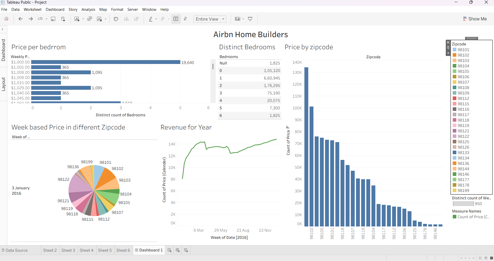

# Tableau Project — Reviews Analysis

## Description

This Tableau project analyzes customer reviews contained in the dataset `reviews.csv`. It contains dashboards that explore overall ratings, sentiment trends, ratings by category, and example visualizations useful for tracking product or service feedback over time.

## Data

- Source file: `reviews.csv` (located in the repository root)

## How to open

1. Open Tableau Desktop or Tableau Public.
2. Connect to a text file and select `reviews.csv`, or open an existing Tableau workbook (`.twb` / `.twbx`) if available.
3. Use the sheets in the workbook to view dashboards and interact with filters.

## Images

- 

